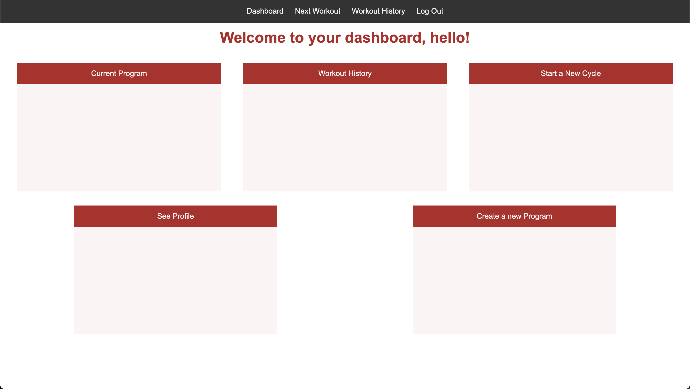

# Workout App
This app allows users to set goals, load cycles of a program, and create their own program.

## Links
Click [here](https://docs.google.com/document/d/1QYKE8MAQUzMlrOlfxMY_YOGExchS5lZz4QhHo-hjvd0/edit?usp=sharing) to access the planning materials and proposal.

Click [here](https://lucid.app/lucidchart/3bb8d459-960b-47d2-8f85-21a77968fb33/edit?viewport_loc=-1412%2C-293%2C2173%2C1026%2C0_0&invitationId=inv_6bc1d5f8-bbcd-4dd4-a11f-d3effe104924)  to access the ERD.

Click [here](https://www.canva.com/design/DAGMtvpog8k/1hZ3802-kK5Eerc7Ld4c8g/edit?utm_content=DAGMtvpog8k&utm_campaign=designshare&utm_medium=link2&utm_source=sharebutton) to access with wireframes.

## Technologies Used

HTML
CSS
Javascript
Node
Express
MongoDB
Mongoose

## Stretch Goals

finish program builder with SetStructure and Sets
connect cycle and program to view possible programs dynamically
update cycle with week, workouts, components, and sets.
